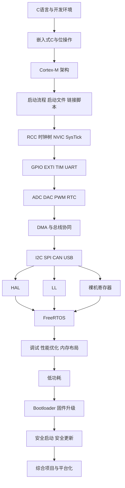
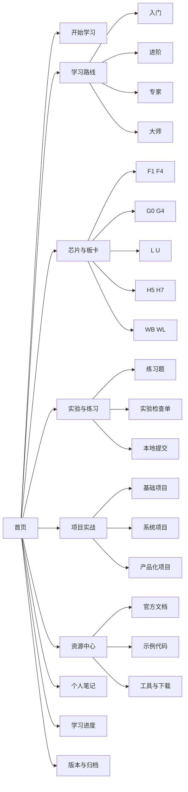
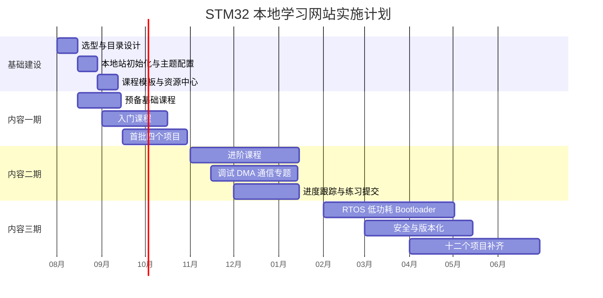

# 个人本地 STM32 学习网站建设与课程体系分析报告

## 执行摘要

如果你的目标是“先在个人电脑本地搭建一个可长期维护、可逐步扩容、适合从小白一路学到能做复杂项目的 STM32 学习网站”，最稳妥的路线不是先追求花哨前端，而是采用 **docs-as-code** 思路：以 Markdown 为内容源、以 Git 为版本底座、以静态站点生成器为交付方式、以 ST 官方文档与示例库为知识主轴。STM32 本身的生态已经覆盖了选型、配置、开发、调试、烧录、示例代码、应用笔记与社区支持；ST 官方又提供了 STM32CubeMX、STM32CubeIDE、STM32Cube MCU Packages、Example Library、CubeProgrammer、CubeCLT 等工具链，因此非常适合做成一个“课程 + 实验 + 代码仓库 + 项目档案”的本地学习站。citeturn4search7turn4search10turn4search13turn0search2turn18search3turn21search0turn12view2

课程体系上，建议把学习目标分成 **入门、进阶、专家、大师** 四层，再按 **预备基础、单片机基础、外设与驱动、系统与调试、产品化能力** 五个阶段组织内容。知识主线应从 C 语言与嵌入式开发习惯出发，逐步进入 Cortex-M 架构、启动流程、中断、时钟树、GPIO/EXTI/定时器、ADC/DAC、DMA、UART/I2C/SPI/CAN/USB、HAL/LL/裸机三种编程层次、FreeRTOS、低功耗、Bootloader、固件升级、安全与性能优化，最终落在项目实战与可维护工程结构。这样安排与 ST 的文档结构、Cube 软件包能力以及 Arm CMSIS/FreeRTOS 的学习顺序是吻合的。citeturn0search9turn14view0turn0search15turn3search4turn0search5turn3search1turn3search3turn15search0turn15search1

在本地网站技术选型上，若你当前优先级是“**本地部署快、技术债低、文档体验强、搜索和离线访问好**”，首选应是 **MkDocs + Material for MkDocs**：它天然面向项目文档，使用 Markdown/YAML，内置浏览器端全文搜索，可配离线模式，支持 Mermaid 图、代码复制按钮、版本化扩展，且非常适合写课程站与实验手册。若你后续想做更强的交互式前端、React 组件化页面、PWA 或复杂版本/多实例文档，再考虑 **Docusaurus** 作为升级路线。citeturn1search1turn1search8turn11search2turn2search1turn2search0turn16search0turn16search2turn1search2turn17search0turn19search0

从实施节奏看，建议把网站建设与内容建设并行推进：第一个月先把本地站点、目录结构、课程模板、搜索与示例代码仓组织好；前三个月专注完成“小白到入门”的完整闭环；六个月覆盖进阶与 RTOS/调试/低功耗；十二个月把 Bootloader、安全、版本化课程、自动化构建与 12 个以上项目案例补齐。这样既能快速看到成果，也不会在一开始就被内容规模与网站工程复杂度压垮。citeturn10search2turn10search7turn21search0turn0search12turn18search3

## 目标受众与能力分级

你的站点至少应服务三类核心用户。第一类是 **完全小白**：可能只学过一点 C，甚至还不理解“寄存器、引脚复用、中断、时钟树、烧录、调试”这些概念；这类用户需要的是低门槛、图解多、每课都有可运行结果。第二类是 **嵌入式初学者**：可能接触过 Arduino、51、ESP32 或学校实验板，能写基本 C 程序，但还不会系统理解 STM32 的外设、驱动层和工程结构。第三类是 **进阶开发者**：已能写常规 HAL 工程，但希望补齐 LL/裸机、RTOS、低功耗、升级、安全、产品化与性能优化。由于 STM32 官方产品线本身就覆盖主流、低功耗、无线与高性能多个方向，你的网站入口也应按“人群 + 芯片方向 + 项目目标”三维组织，而不是只按芯片系列堆文档。citeturn4search2turn9search0turn5search3turn9search1turn9search2

从系列差异角度，初学者最适合从 **F1/F4/G0/G4/L4** 这类资料多、板卡多、示例多的系列切入；做低功耗时应重点转向 **L/U** 系列；做高性能、缓存、复杂总线和更强安全能力时应进入 **H5/H7/N6**；做 BLE、Sub-GHz、LoRa 或无线应用时则需要进入 **WB/WBA/WL/WL3**。ST 官方对这些方向分别给出了主流、高性能、超低功耗与无线分类页面，利于你在课程中按“目标应用”而不是按芯片年代组织。citeturn9search0turn9search1turn9search2turn5search3turn8search21turn8search13

下面这张表适合直接作为站点首页的“学习入口矩阵”。

| 目标用户 | 当前典型状态 | 推荐起步板卡/系列 | 首阶段目标 | 结课标准 |
|---|---|---|---|---|
| 完全小白 | 会基础 C 或刚学 C | NUCLEO-F103RB / NUCLEO-G071RB | 会建工程、下载、调试、点灯、串口打印 | 独立完成 GPIO/EXTI/UART/TIM/ADC 课程与 3 个小项目 |
| 嵌入式初学者 | 做过 Arduino/51/ESP32 | NUCLEO-F103RB / F4 Nucleo / L4 Nucleo | 会看参考手册、理解中断/时钟/DMA/总线 | 能写 1 个带 DMA 与多外设协作的工程 |
| 进阶开发者 | 能写 HAL 工程 | H7/L4/WB/WL 系列板卡 | 掌握 LL/裸机、RTOS、低功耗、升级与调试 | 能完成 Bootloader、低功耗、RTOS、通信协议项目 |
| 专家路线用户 | 有量产/复杂产品目标 | H5/H7/U5/WB/WL + 外置调试器 | 学会安全、版本化、性能优化、工程化 CI | 能产出可持续维护的课程与端到端项目 |
| 大师路线用户 | 追求架构与可复用平台 | H7/U5/WBA/WL3 等专题方向 | 形成平台层、组件化、模板化课程体系 | 能设计自己的 BSP/平台库/升级与安全方案 |

学习目标建议再做一次抽象分层，方便你在导航中使用统一标签：

| 能力层级 | 关注重点 | 必修主题 | 退出能力 |
|---|---|---|---|
| 入门 | 会用工具、会跑例程、会查资料 | C 基础、CubeMX、CubeIDE、GPIO、串口、定时器、ADC、基础调试 | 独立建一个能跑的最小工程 |
| 进阶 | 能写外设驱动、会排错 | 时钟树、中断、DMA、I2C/SPI/CAN/USB、HAL/LL、寄存器、逻辑分析 | 独立完成多外设协同项目 |
| 专家 | 会做系统设计与工程组织 | RTOS、低功耗、文件系统、Bootloader、DFU、性能优化、内存布局 | 独立完成中型项目与升级方案 |
| 大师 | 具备产品化与平台化能力 | 安全启动、固件升级、安全安装、代码复用、组件化、自动化测试、版本化课程 | 能沉淀成可复用平台与教学体系 |

建议把“HAL / LL / 裸机”单独做成一条穿越式主线。ST 官方说明了 HAL 与 LL 在定位上的差异：HAL 强调可移植性与开发效率，LL 是更高性能、更小体积但更偏底层的替代方案；而更底层的裸机/寄存器开发则依赖参考手册、数据手册与 Cortex-M 编程手册来理解寄存器、指令集与核心外设。citeturn0search15turn18search13turn0search6turn14view0

| 编程层次 | 适合阶段 | 优点 | 成本 | 课程建议 |
|---|---|---|---|---|
| HAL | 入门、进阶 | 上手快、示例多、跨系列迁移友好 | 抽象层较厚 | 作为主线起步，保证学习闭环 |
| LL | 进阶、专家 | 控制更细、性能更好、占用更小 | API 更底层，理解门槛更高 | 在定时器、DMA、串口、低功耗章节穿插对比 |
| 裸机寄存器 | 进阶后期、专家/大师 | 训练硬件理解能力，便于优化与排障 | 学习曲线陡 | 以“启动流程、GPIO、SysTick、NVIC、RCC”做示范，不建议一开始全站裸机化 |

下面这份学习阶段表，可直接转成网站里的课程总览页。

| 阶段 | 核心模块 | 预计学习时长 | 先修要求 | 输出成果 |
|---|---|---:|---|---|
| 预备基础 | C 语言基础、位运算、指针、结构体、Make/编译概念、Git 基础 | 30–50 小时 | 无 | 读懂 STM32 工程目录，完成 C 小作业与 Git 提交 |
| 入门阶段 | STM32 选型、板卡认识、CubeMX、CubeIDE、时钟树概念、GPIO/EXTI/UART/TIM/ADC | 50–80 小时 | 预备基础 | 点灯、按键中断、串口终端、PWM 呼吸灯、ADC 采样 |
| 进阶阶段 | DMA、I2C、SPI、RTC、Flash、看门狗、HAL/LL 对比、逻辑分析、故障定位 | 80–120 小时 | 入门阶段 | OLED/EEPROM/Sensor 项目，DMA 环形采样与日志系统 |
| 专家阶段 | FreeRTOS、任务同步、低功耗、USB/CAN/文件系统、内存布局、性能优化 | 120–180 小时 | 进阶阶段 | 任务化数据采集系统、低功耗唤醒项目、USB 设备项目 |
| 大师阶段 | Bootloader、固件升级、SBSFU/SFI 概念、安全、平台层、CI、版本化课程、复杂项目实战 | 180–260 小时 | 专家阶段 | 可升级固件框架、安全更新演示、完整课程站与项目仓库 |

这条路线覆盖的知识点，与 ST 的官方文档类型、Cube 软件包、Cortex-M 编程手册、RTOS 和 Bootloader/安全资料是对齐的；也就是说，你的课程结构本质上应该“顺着官方资料的认知路径来设计”，这样后续扩充到不同系列时成本最低。citeturn0search9turn0search2turn14view0turn3search4turn3search1turn3search3turn15search0turn15search3

建议在网站中为这条学习路线配一张“课程关系图”：



## 教学资源与示例代码

资源策略建议遵循一个顺序：**先官方、再官方社区、再高质量开源库、最后才是民间教程**。因为 STM32 学习中最容易出现的误区，不是“找不到资料”，而是“资料太多但层级混乱”。以芯片为中心时，最核心的永远是数据手册、参考手册、编程手册、勘误表与应用笔记；以开发为中心时，最核心的是 CubeMX、CubeIDE、Cube MCU Package、Example Library 与官方 GitHub 仓库。citeturn0search9turn4search7turn4search13turn0search2turn18search3turn18search0

下表给出一套适合直接挂到网站“资源中心”页面的首批高质量资源清单。为了符合你“优先中文与官方/原始资料”的要求，我优先放入 ST 中文入口与官方原始资料；“链接”列用可点击的官方入口引用表示。

| 资源 | 类型 | 语言 | 主要用途 | 可信度 | 链接 |
|---|---|---|---|---|---|
| STM32 MCU 开发者社区 | ST 官方中文门户 | 中文 | 作为 STM32 文档、工具、示例和社区的总入口 | 很高 | 官方入口 citeturn4search7 |
| STM32 32-bit Arm Cortex MCUs 文档页 | ST 官方文档聚合 | 英文 | 查 Reference Manual、Data Sheet、User Manual、App Note、Errata | 很高 | 官方入口 citeturn0search9 |
| STM32 教育与课程页 | ST 官方学习入口 | 中文 | 看线上课程、播放列表、专题培训 | 很高 | 官方入口 citeturn4search0 |
| STM32CubeMX | ST 官方工具 | 中/英 | 选型、引脚/时钟/中间件配置、初始化代码生成 | 很高 | 官方入口 citeturn4search10 |
| STM32CubeIDE | ST 官方 IDE | 中文 | 建工程、编译、调试、代码编辑、与 CubeMX 集成 | 很高 | 官方入口 citeturn4search13 |
| STM32Cube MCU & MPU Packages | ST 官方软件包 | 英文 | 获取 HAL/LL/CMSIS/Middleware/BSP/Projects/Examples | 很高 | 官方入口 citeturn0search2 |
| STM32 Example Library | ST 官方示例库入口 | 英文 | 按板卡/外设检索官方示例代码 | 很高 | 官方入口 citeturn18search3 |
| STM32Cube MCU Overall Offer | ST 官方 GitHub 总入口 | 英文 | 浏览 ST 在 GitHub 上的各系列仓库和中间件仓库 | 很高 | 官方入口 citeturn18search0 |
| STM32CubeF1 / F4 / G0 等系列仓库 | ST 官方 GitHub 仓库 | 英文 | 获取具体系列的 Drivers/Middleware/Projects/Examples | 很高 | F1 citeturn18search8 / F4 citeturn18search6 / G0 citeturn8search1 |
| STM32CubeIDE Basics MOOC | ST 官方 MOOC | 英文 | 理解 CubeIDE 的典型工作流 | 很高 | 官方入口 citeturn0search8 |
| Arm CMSIS 文档 | Arm 官方 | 英文 | 学习 CMSIS Core、设备抽象、DSP/NN 扩展的入口 | 很高 | 官方入口 citeturn3search4 |
| FreeRTOS 文档 | FreeRTOS 官方 | 英文 | 学 RTOS 基础、任务、队列、同步与移植 | 很高 | 官方入口 citeturn3search1 |
| STM32CubeProgrammer | ST 官方工具 | 英文 | SWD/JTAG/串口/USB DFU/I2C/SPI/CAN 烧录与验证 | 很高 | 官方入口 citeturn0search12 |
| STM32CubeCLT | ST 官方命令行工具 | 英文 | 适合本地自动化、脚本化构建和 CI/CD | 很高 | 官方入口 citeturn21search0 |
| STM32Trust | ST 官方安全生态 | 英文 | 学习 STM32 上的安全功能与方法论 | 很高 | 官方入口 citeturn15search1 |
| X-CUBE-SBSFU | ST 官方安全更新方案 | 英文 | 学 Secure Boot 与 Secure Firmware Update | 很高 | 官方入口 citeturn15search0 |
| Bootloader AN2606 | ST 官方应用笔记 | 英文 | 了解系统 Boot ROM、支持接口与约束 | 很高 | 官方入口 citeturn3search3 |
| OpenOCD 文档 | OpenOCD 官方 | 英文 | 学开源调试/烧录工具链，补充 GDB 调试能力 | 高 | 官方入口 citeturn3search2 |
| ST 中文论坛 / ST Community | ST 官方社区 | 中文 | 查常见坑、FAQ、经验贴、官方答复 | 高 | 中文论坛 citeturn4search3 / 社区总站 citeturn4search18 |

如果你要把“如何读 STM32 文档”也做成单独课程，建议固定一个模板：**先数据手册看封装、电压、外设资源与引脚复用；再参考手册看寄存器；再 Cortex-M 编程手册理解核心行为；最后结合应用笔记、勘误表与软件包示例落地。** 这种文档阅读顺序与 ST 的官方文档组织方式完全匹配。citeturn0search9turn0search6turn14view0

## 本地网站架构与技术选型

从“个人本地学习站”的实际需求看，你需要的能力通常包括：Markdown 友好、目录层级清晰、代码高亮、Mermaid 图、站内搜索、离线打开、Git 易管理、可版本化、能把示例代码单独维护。基于这些条件，**首推 MkDocs + Material for MkDocs**，备选是 **Docusaurus**；而 **Hugo、Jekyll、Hexo** 更适合偏博客或希望更自由自定义模板的人。MkDocs 本体就是“面向项目文档的静态站点生成器”，Material 又进一步提供可搜索、多语言、离线、Mermaid、代码复制等能力，因此极适合做技术课程站。Docusaurus 的优势则是 React 化、文档版本控制、多实例文档、PWA 和更丰富的前端交互。citeturn1search1turn1search8turn11search2turn2search1turn16search0turn16search2turn1search2turn17search0turn19search0turn19search8

### 静态站点生成器比较

| 方案 | 技术栈 | 优点 | 局限 | 推荐结论 |
|---|---|---|---|---|
| MkDocs + Material citeturn1search1turn1search8turn11search2turn2search1turn2search0turn16search0turn16search2 | Python + Markdown | 文档导向最强；配置简单；本地搜索成熟；可离线；支持 Mermaid、代码复制、版本化扩展 | 页面交互能力不如 React 生态强 | **最推荐，适合作为第一版本地 STM32 学习站** |
| Docusaurus citeturn1search2turn10search3turn17search0turn17search1turn19search0turn19search8 | Node.js + React + Markdown | 交互能力强；版本化、i18n、插件体系完善；适合后期升级成公共站点 | 前端门槛更高；内容团队少时维护成本偏高 | **作为二期升级方案** |
| Hugo citeturn1search0turn17search2turn19search1turn19search5 | Go | 构建极快；多语言能力好；模板灵活 | 搜索通常要额外方案；文档站默认体验不如 Material 开箱即用 | 适合追求速度与自定义模板的用户 |
| Jekyll citeturn1search6turn19search2turn19search18 | Ruby | 博客感强；生态老牌；插件机制成熟 | Ruby 环境对很多嵌入式学习者不够友好 | 适合已有 Jekyll 经验者 |
| Hexo citeturn1search3turn17search7turn17search11 | Node.js | 建博客很轻快；插件/主题多 | 更偏博客，不是最强文档站基座 | 适合“博客 + 学习笔记”型网站 |

### 示例代码托管方式比较

| 托管方式 | 适合场景 | 优点 | 风险或局限 | 推荐用法 |
|---|---|---|---|---|
| Git 子模块 citeturn2search3turn19search15turn8search0 | 课程与示例仓分离 | 主站与代码仓解耦；保留独立提交历史；适合引入 ST 官方仓 | 克隆与更新要注意 `--recursive`；新手易忘 | **推荐**：主站一个仓，`examples/` 下多个子模块 |
| GitHub 仓库 citeturn18search0turn18search1 | 将来公开协作 | 分享方便、PR 流程成熟、社区贡献友好 | 纯本地阶段不是必须；若子模块指向私仓需额外管理 | 二期公开时启用 |
| GitLab 仓库 | 私有协作/自托管 | 流程完整、可自托管 | 首个个人本地站会增加管理复杂度 | 有私有协作需求再上 |
| 本地 Git 仓库 | 纯离线个人学习 | 简单、无需联网、最稳 | 不便于异机协作；外部备份与分享不便 | **可以作为最初形态**，但建议仍保留远端镜像备份 |

如果只考虑你现在的需求，我的明确建议是：

**推荐组合：MkDocs + Material + Git 主仓 + `examples/` 多子模块 + 浏览器本地进度记录 + 可选本地 FastAPI 提交服务。**

这套组合既能保证最短搭建路径，又能为未来扩展到版本化、多设备同步、公开发布、多人贡献留足空间。MkDocs/Material 在本地搜索、离线能力、Mermaid、代码复制方面都是现成能力；Git 子模块又非常适合把示例工程与课程文本拆开维护。citeturn11search2turn2search1turn16search0turn16search2turn2search3turn8search0

下面这张图可以直接作为你的网站信息架构草图：



你还可以在首页放一个非常朴素但实用的页面草图，先把信息架构跑通，再去做美化：

```text
┌───────────────────────────────────────────────────────────────┐
│ STM32 学习站                                                 │
│ 从小白到大师 · 本地优先 · 官方资料驱动                       │
├───────────────────────────────────────────────────────────────┤
│ [开始学习] [学习路线] [项目实战] [资源中心] [进度] [搜索]    │
├───────────────────────────────────────────────────────────────┤
│ 今日继续                                                     │
│ - 上次学到：DMA 环形缓冲                                     │
│ - 推荐下一课：UART + DMA 日志系统                            │
│ - 当前进度：进阶阶段 42%                                     │
├───────────────────────────────────────────────────────────────┤
│ 学习入口                                                     │
│ [完全小白]  [初学者]  [进阶开发者]  [专家/大师]              │
├───────────────────────────────────────────────────────────────┤
│ 专题                                                         │
│ [C基础] [Cortex-M] [GPIO] [时钟树] [DMA] [RTOS] [Bootloader] │
├───────────────────────────────────────────────────────────────┤
│ 最新项目                                                     │
│ - 串口命令行终端                                             │
│ - 低功耗数据记录仪                                           │
│ - 安全固件升级演示                                           │
└───────────────────────────────────────────────────────────────┘
```

## 本地开发与部署步骤

下面给出一套面向 **Windows / macOS / Linux** 的“从零开始、本地优先”的搭建方案。默认路线是 **MkDocs + Material**，因为这是最短路径；它的安装前提也非常简单：需要 Python 与 pip，Material 通过 pip 安装，项目可用 `mkdocs` 命令快速初始化。citeturn10search0turn10search2turn10search7turn10search22

### 准备本地工具

如果你已经有 Python 3、Git，可以直接跳到下一步。没有的话，Windows 可以用 winget，macOS 常见做法是 Homebrew，Linux 常见做法是系统包管理器；如果你不想用包管理器，也可以直接从 Python/Git 官方安装器安装。MkDocs 官方说明只要求有较新的 Python 与 pip。citeturn10search0turn10search2

```powershell
# Windows PowerShell
winget install Python.Python.3.12
winget install Git.Git
```

```bash
# macOS
brew install python git
```

```bash
# Ubuntu / Debian
sudo apt update
sudo apt install -y python3 python3-venv python3-pip git
```

### 初始化项目与虚拟环境

```bash
mkdir stm32-learning-site
cd stm32-learning-site

# Windows
py -3 -m venv .venv
.venv\Scripts\activate

# macOS / Linux
python3 -m venv .venv
source .venv/bin/activate
```

```bash
python -m pip install --upgrade pip
pip install mkdocs-material pymdown-extensions mike jieba
```

上面这套安装里，`mkdocs-material` 提供主题；`mike` 用于文档版本化；`jieba` 可用于改进中文搜索分词；Material 官方文档说明其内置搜索基于浏览器端全文索引，离线插件支持把整站以离线方式分发，版本化则可通过 `mike` 集成。citeturn10search7turn11search2turn2search1turn2search0turn11search1

### 创建站点骨架

```bash
mkdocs new .
mkdir -p docs/{getting-started,tracks,boards,peripherals,rtos,bootloader,security,projects,resources,notes}
mkdir -p examples tools backups
git init
```

生成后的建议目录结构如下：

```text
stm32-learning-site/
├─ docs/
│  ├─ index.md
│  ├─ getting-started/
│  ├─ tracks/
│  ├─ boards/
│  ├─ peripherals/
│  ├─ rtos/
│  ├─ bootloader/
│  ├─ security/
│  ├─ projects/
│  ├─ resources/
│  └─ notes/
├─ examples/
├─ tools/
├─ backups/
├─ mkdocs.yml
└─ requirements.txt
```

### 最小可用配置

下面这份 `mkdocs.yml` 可以直接作为第一版：

```yaml
site_name: STM32 学习站
site_description: 从小白到大师的 STM32 本地学习网站
site_url: http://127.0.0.1:8000
repo_name: stm32-learning-site
docs_dir: docs
site_dir: site

theme:
  name: material
  language: zh
  features:
    - navigation.tabs
    - navigation.sections
    - navigation.expand
    - content.code.copy
    - content.code.annotate
    - content.tabs.link
    - search.suggest
    - search.highlight

plugins:
  - search
  - offline

markdown_extensions:
  - admonition
  - attr_list
  - tables
  - toc:
      permalink: true
  - pymdownx.highlight
  - pymdownx.superfences
  - pymdownx.inlinehilite
  - pymdownx.tabbed:
      alternate_style: true
  - pymdownx.details
  - pymdownx.tasklist:
      custom_checkbox: true

extra:
  version:
    provider: mike

nav:
  - 首页: index.md
  - 开始学习:
      - 环境搭建: getting-started/setup.md
      - 第一个工程: getting-started/first-project.md
  - 学习路线:
      - 入门: tracks/beginner.md
      - 进阶: tracks/advanced.md
      - 专家: tracks/expert.md
      - 大师: tracks/master.md
  - 芯片与板卡:
      - F1/F4: boards/f1-f4.md
      - G0/G4: boards/g0-g4.md
      - L/U: boards/l-u.md
      - H5/H7: boards/h5-h7.md
      - WB/WL: boards/wb-wl.md
  - 外设专题:
      - GPIO/EXTI: peripherals/gpio-exti.md
      - TIM/PWM: peripherals/tim-pwm.md
      - ADC/DMA: peripherals/adc-dma.md
      - UART/I2C/SPI: peripherals/uart-i2c-spi.md
  - 系统专题:
      - RTOS: rtos/freertos.md
      - Bootloader: bootloader/overview.md
      - 安全: security/overview.md
  - 项目实战:
      - 项目清单: projects/index.md
  - 资源中心: resources/index.md
  - 个人笔记: notes/index.md
```

Material 官方明确支持 Mermaid 图与代码复制按钮，搜索插件是浏览器端搜索，离线插件支持离线文档分发，因此以上配置非常适合本地课程站。citeturn16search0turn16search2turn11search2turn2search1

### 启动预览与构建

```bash
mkdocs serve -a 127.0.0.1:8000
```

浏览器打开本地地址后即可实时预览。发布成本地静态目录时：

```bash
mkdocs build --clean --strict
```

如果你想做课程版本化：

```bash
mike deploy 0.1 latest
mike set-default latest
```

### 把官方示例工程纳入站点

STM32Cube 各系列仓库已经大量使用 Git 子模块组织；Git 官方也明确说明子模块的用途就是把一个仓库作为另一个仓库的子目录来管理。因此，最适合你的做法不是把所有示例代码直接复制进主站，而是把你常用的系列仓库作为 `examples/` 下的子模块，再在课程里引用对应路径。citeturn8search0turn2search3turn19search15

```bash
git submodule add https://github.com/STMicroelectronics/STM32CubeF1.git examples/STM32CubeF1
git submodule add https://github.com/STMicroelectronics/STM32CubeF4.git examples/STM32CubeF4
git submodule add https://github.com/STMicroelectronics/STM32CubeG0.git examples/STM32CubeG0
git submodule add https://github.com/STMicroelectronics/STM32CubeWB.git examples/STM32CubeWB
git submodule add https://github.com/STMicroelectronics/stm32wl-openbl-apps.git examples/stm32wl-openbl-apps
```

后续重新克隆主仓库时，请使用：

```bash
git clone --recursive <你的仓库地址>
```

### 为课程加入本地进度跟踪

如果你坚持“纯静态、纯本地、不开数据库”，最省事的方案就是 **浏览器 `localStorage` 记录课程完成状态**。实现方式很简单：每篇课程页面底部放一个“已完成”按钮或任务清单，用少量前端脚本把状态按 `lesson-id` 存在浏览器本地。这样完全离线，无需后端。  
如果你希望“本地提交笔记/练习答案到文件系统”，则建议再加一个仅在本机运行的轻量服务，例如 FastAPI，把表单内容写入 `submissions/` 目录。这个服务不是必须，但会让“练习提交”和“本地备份”更干净。

示例前端脚本可做成 `docs/javascripts/progress.js`：

```javascript
document.addEventListener("DOMContentLoaded", () => {
  const key = "stm32-learning-progress";
  const state = JSON.parse(localStorage.getItem(key) || "{}");

  document.querySelectorAll("[data-lesson-id]").forEach((el) => {
    const id = el.dataset.lessonId;
    if (state[id]) el.checked = true;

    el.addEventListener("change", () => {
      state[id] = el.checked;
      localStorage.setItem(key, JSON.stringify(state));
    });
  });
});
```

页面中这样使用：

```md
- [ ]{ data-lesson-id="gpio-001" } 完成 GPIO 输入输出实验
- [ ]{ data-lesson-id="gpio-002" } 完成 EXTI 按键中断实验
```

### 课程工程自动化与 CI

如果后面你要做“课程更新自动检查 + 示例工程自动编译”，可以把网站构建和 MCU 工程构建拆成两条流水线：  
一条是文档线，执行 `mkdocs build --strict`；另一条是嵌入式工程线，使用 **STM32CubeCLT** 按命令行方式编译、链接、烧录甚至调试。ST 官方对 CubeCLT 的定位非常明确：它是多操作系统命令行工具集，适合第三方 IDE 与 CI/CD；其中包含 GNU Arm 工具链、GDB 和 STM32CubeProgrammer。citeturn21search0turn21search3

你可以把课程仓里的检查流程定义成：

```bash
# 文档检查
mkdocs build --clean --strict

# MCU 示例构建（示意）
# 由 STM32CubeCLT 或 CubeIDE headless / CLI 驱动
# 根据你的工程路径执行具体编译命令
```

### 常见问题与解决方案

| 问题 | 常见原因 | 解决方案 |
|---|---|---|
| `pip` 或 `mkdocs` 找不到 | 虚拟环境未激活，或 PATH 未生效 | 先激活 `.venv`，再用 `python -m pip` 安装 |
| 中文搜索效果差 | 中文分词未优化 | 安装 `jieba`，并尽量让标题、关键词、术语表规范化 citeturn11search1turn11search2turn11search8 |
| Mermaid 图不显示 | 配置未启用相应扩展或写法不规范 | 按 Material 图表文档启用 Mermaid 支持并使用标准代码块写法 citeturn16search0 |
| 子模块目录是空的 | 克隆时没加 `--recursive` | 使用 `git clone --recursive` 或后续执行 `git submodule update --init --recursive` citeturn2search3turn8search0 |
| ST 官方示例仓太大 | 一次性引入太多系列 | 先只引入 F1/F4/G0/WB/WL 等你当前课程需要的系列 |
| Nucleo 开发板连上后不识别/调试异常 | PC 没放行接口、驱动/USB 环境异常 | Nucleo 板通常集成 ST-LINK，支持 Virtual COM、Debug 等接口；检查 USB 线、驱动与主机是否允许相关接口 citeturn12view2turn5search0turn5search9 |

## 课程组织与可扩展性

要让这类学习站真正长期可用，关键不只是“内容多”，而是“内容结构稳定、模板统一、更新可回溯”。课程文件建议统一采用 **一个页面 = 一个 lesson** 的方式，并固定 front matter 与资源引用约定。这样后面你无论是做统计、索引、进度、导出还是版本化，都不会返工。

建议的 lesson 模板如下：

```md
---
title: GPIO 输入输出基础
level: beginner
series: [F1, G0, F4]
board: [NUCLEO-F103RB, NUCLEO-G071RB]
prerequisites:
  - C 语言条件判断
  - 开发环境安装
estimated_time: 90min
outputs:
  - 点亮板载 LED
  - 完成按键控制 LED
resources:
  - stm32cube-package
  - reference-manual
  - example-library
---

# 目标
# 背景知识
# 实验步骤
# 代码讲解
# 常见错误
# 练习题
# 扩展阅读
```

站内章节组织建议遵循“**概念页 + 实验页 + 项目页 + 参考页**”四件套。  
例如 DMA 专题下，不要只有一个长文，而应拆成：

- `dma-concepts.md`：原理与典型模式  
- `dma-adc-circular-lab.md`：实验  
- `dma-uart-logger-project.md`：项目  
- `dma-reference.md`：寄存器、API、常见坑索引  

这种拆法非常适合未来做课程版本化。Material 可通过 `mike` 管理多版本文档；Docusaurus 也原生提供文档版本控制。如果你将来打算把 F1/F4 老路线与 H5/H7 新路线长期并存，这两种机制都很有价值。citeturn2search0turn17search0

用户进度跟踪建议分两层做：

| 层次 | 方案 | 优点 | 局限 |
|---|---|---|---|
| 纯本地静态 | `localStorage` 记录 lesson/task 状态 | 最简单、零后端、离线可用 | 只能保存在当前浏览器 |
| 本地增强版 | `localStorage` + 本地 JSON 导出/导入 | 可备份、可迁移到另一台电脑 | 需要你写一点导入导出脚本 |
| 本地服务版 | FastAPI/Flask 写文件到 `submissions/` | 可记录练习答案、实验截图路径、打分结果 | 需要运行本机服务 |

备份与导出建议一定要提前设计，不要等内容多了再补。比较实用的方案是：

1. **Git 作为第一层备份**：课程与配置都进版本库。  
2. **每周导出静态站 `site/` 目录 zip**：用于离线浏览归档。  
3. **每周导出 `progress.json` 与 `submissions/`**：保护个人学习记录。  
4. **定期做整仓镜像或 `git bundle`**：用于跨设备迁移。  
5. **示例代码仓与课程仓分离**：避免主站仓库体积膨胀。  

如果你后面希望吸引贡献者，这套架构也很友好：课程文稿改 Markdown、示例工程改独立仓、页面图示用 Mermaid 文本化保存，贡献门槛低，冲突也少。Docusaurus 与 MkDocs 都强调文档即代码的协作方式；ST 官方社区和中文论坛则可作为“问题收集与外部问答入口”。citeturn1search1turn1search2turn4search3turn4search18

## 示例项目与实施时间表

示例项目建议遵循两条原则：**由浅入深**，以及 **每个项目至少锚定一个核心主题**。你要避免“项目只是把前面知识点机械拼在一起”，而应让每个项目都承担一个教学目标，比如“理解 DMA 环形缓冲”“第一次体会低功耗与唤醒”“第一次做可升级固件”“第一次看到安全更新的意义”。

下表给出一套适合你网站的 12 个项目清单。参考代码链接优先给到 ST 官方 Example Library、系列仓库或官方相关仓库；具体工程路径可在站内再按板卡细化。citeturn18search3turn18search0

| 项目 | 目标 | 难点 | 所需外设/资源 | 预期成果 | 参考代码入口 |
|---|---|---|---|---|---|
| 板载 LED 与按键 | 学会 GPIO、Exti、下载与调试 | 引脚模式、中断消抖 | GPIO、EXTI | 完成第一个可调试工程 | Example Library / CubeF1 citeturn18search3turn18search8 |
| 串口命令行终端 | 学会 UART 收发与调试日志 | 字符串解析、阻塞/中断区别 | UART | 串口菜单与参数配置 | Example Library / CubeF4 citeturn18search3turn18search6 |
| PWM 呼吸灯与蜂鸣器 | 学会 TIM/PWM | 定时器时基与占空比 | TIM/PWM | 稳定 PWM 输出与不同频率控制 | CubeF1 / CubeG0 citeturn18search8turn8search1 |
| ADC 电压表 | 学会 ADC 单次/连续采样 | 校准、采样周期、缩放换算 | ADC | 串口或 OLED 显示电压值 | CubeF4 / CubeG0 citeturn18search6turn8search1 |
| ADC + DMA 环形采样 | 理解 DMA 与缓冲区 | 数据一致性、回调时序 | ADC、DMA | 实时采样曲线或统计值 | CubeF4 / Example Library citeturn18search6turn18search3 |
| I2C OLED/EEPROM 驱动 | 学会 I2C 总线与驱动层封装 | ACK、时序、总线异常恢复 | I2C | 显示菜单或读写 EEPROM | CubeF4 / CubeG0 citeturn18search6turn8search1 |
| SPI 传感器/Flash 驱动 | 学会 SPI 与片选管理 | 收发时序、状态机 | SPI | 读取传感器或外部 Flash | CubeF4 / STM32Cube Overall Offer citeturn18search6turn18search0 |
| RTC 闹钟与低功耗唤醒 | 学会 RTC、Stop/Standby | 唤醒源、功耗测量 | RTC、PWR | 定时唤醒数据记录器 | L 系列/超低功耗资料 citeturn5search3turn0search2 |
| FreeRTOS 任务化环境监测 | 学会任务、队列、互斥、定时器 | 并发与资源共享 | UART/I2C/ADC + RTOS | 多任务采集和日志系统 | FreeRTOS + Cube Packages citeturn3search1turn0search5 |
| USB CDC 或 USBX 设备 | 学会 USB 设备通信 | 描述符、枚举、缓冲管理 | USB | 电脑识别为虚拟串口或 USB 设备 | USBX/USB 官方示例 citeturn18search11turn18search5 |
| 串口/无线 Bootloader 升级 | 学会 Bootloader 与升级链路 | 跳转、镜像校验、回滚 | UART / SPI / 无线链路 | 可升级应用程序框架 | AN2606 / Open Bootloader citeturn3search3turn18search15turn8search2 |
| 安全固件更新演示 | 理解 Secure Boot / Secure Firmware Update | 签名、认证、流程设计 | 安全中间件/升级通路 | 演示安全更新与基本信任链 | X-CUBE-SBSFU / STM32Trust citeturn15search0turn15search1turn15search3 |

如果你希望再补无线专题，可以追加第 13 个项目：“**STM32WL LoRa 节点**”或“**STM32WB BLE 传感器节点**”。ST 对无线产品线和相关软件包均有官方支持，适合放在专家到大师之间。citeturn9search1turn8search23turn4search17

### 分阶段实施计划

下面给出一个可执行的 3 个月、6 个月、12 个月时间表。它不是“最快”，但比较现实。

| 时段 | 要完成的事情 | 成果物 |
|---|---|---|
| 3 个月 | 搭好本地站、确定目录与模板、完成预备基础 + 入门阶段主线、首批 4 个项目 | 可用本地站、完整首页导航、至少 20–30 篇课程页 |
| 6 个月 | 完成进阶阶段、补全 DMA/通信/调试/低功耗、加入进度跟踪与代码仓组织、累计 8–10 个项目 | 体系化课程站、可离线打包、具备项目索引与资源中心 |
| 12 个月 | 完成专家/大师阶段、Bootloader/安全/版本化课程、自动化构建、累计 12+ 个项目 | 可长期维护的 STM32 学习平台雏形 |

建议把里程碑也写成一张 Mermaid 甘特图，后面直接放进网站主页或 README：



## 维护策略、版权许可与硬件建议

长期维护时，最常见的问题不是“没有内容”，而是“内容更新失控”。因此建议你在站内明确区分三类内容状态：**稳定版课程、实验中课程、归档课程**。再配一个简单的版本标签体系，例如 `stable / draft / archived`，配合 `mike` 或 Git tag 管理。这样你后面即便同时维护“F1/F4 老路线”和“H5/H7 新路线”，也不会把学习者带进半成品页面。citeturn2search0turn17search0

关于版权与许可，最实用的做法是：  
课程正文与自制图示使用你自己的许可证（例如保留署名或更宽松开源）；  
官方文档只做**摘要、解释、页码索引与引用**，不要把整份 PDF 重新分发到你的网站仓库；  
示例代码尽量通过 **官方仓库链接 / 子模块 / 引用路径** 使用，并遵循各仓库自带的 LICENSE。ST 官方 GitHub 仓库、Hugo、Material、Docusaurus 等项目都在各自页面上公开了许可证与贡献规范。citeturn18search0turn8search0turn1search0turn1search12turn10search16

如果将来希望吸引贡献者，最有效的不是先做“社区系统”，而是先让贡献路径非常清晰：  
一类人贡献课程文稿；  
一类人贡献示例工程；  
一类人补充板卡/芯片差异；  
一类人修正图示、FAQ 和常见坑。  
ST 社区本身已经是很好的问题收集源；你的网站可以只负责“整理、消化、结构化”，不必自己从零搭讨论论坛。citeturn4search18turn4search3

### 硬件采购建议

从学习效率看，最值得优先购买的不是“最贵板卡”，而是“资料多、示例多、调试方便”的板卡。ST 官方明确说明 Nucleo 系列价格友好、适合快速原型，并且很多板卡集成 ST-LINK 调试器，无需单独探针；如果你准备做外部目标板调试，再补一个独立 ST-LINK/V3MINIE 或 V3SET。citeturn5search0turn12view2turn5search9turn5search1

| 类别 | 建议型号 | 适合用途 | 选择理由 | 参考入口 |
|---|---|---|---|---|
| 入门板 | NUCLEO-F103RB | 最经典入门、资料极多 | F1 生态成熟，Nucleo 集成 ST-LINK | citeturn6search0turn12view2 |
| 新手主力板 | NUCLEO-G071RB | 学现代入门主流系列 | G0 属于主流系列，成本友好 | citeturn6search1turn9search0 |
| 低功耗板 | 选 L4/L4+ Nucleo | 低功耗、RTC、唤醒实验 | ST 官方低功耗产品线资料完整 | citeturn5search3turn5search0 |
| 高性能板 | NUCLEO-H753ZI | Cache、DMA、复杂通信、性能优化 | H7 更适合做专家/大师阶段 | citeturn7search0turn9search2 |
| IoT / 传感器板 | B-L475E-IOT01A | 无线、传感器、云连接入门 | 板载多种传感器与无线功能，适合做系统项目 | citeturn6search3 |
| 独立调试器 | STLINK-V3MINIE | 调试自制板、外部目标板 | 体积小，支持 SWD/JTAG 与虚拟串口 | citeturn5search9 |
| 更强调试器 | STLINK-V3SET | 更灵活的独立调试/编程 | 模块化、适合更完整的实验台 | citeturn5search1 |

补充两点比较关键的采购细节。其一，如果你本来想买 NUCLEO-H743ZI，需要注意 **H743ZI 官方页面已显示停产/obsolete**，当前更稳妥的替代是 **NUCLEO-H753ZI**。其二，很多 Nucleo 板已经集成了 ST-LINK，所以在入门阶段你完全可以先不买独立探针，把预算留给面包板、电源模块、杜邦线、逻辑分析仪、USB 转串口、常见 I2C/SPI 传感器模块。citeturn6search2turn7search0turn5search0turn12view2

综合以上分析，最推荐你现在就落地的方案可以浓缩成一句话：

**先用 MkDocs + Material 在本机搭一个“课程站雏形”，用 ST 官方文档和官方示例仓作知识与代码底座，用 Git 子模块管理示例工程，用 localStorage 做进度，用 12 个项目串起从 C 到 Bootloader/安全的整个成长路径。**

这条路线的优点是：启动快、维护稳、学习闭环清晰，而且不会把你困在前端技术细节里。对于一个“先本地、后迭代、长期自学”的 STM32 学习网站，这通常是最合理也最可持续的第一版。citeturn1search1turn1search8turn2search1turn18search0turn18search3turn21search0