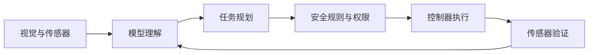

# 2026 年 AI 发展趋势：已经落地的新技术

**发布日期：2026 年 7 月 30 日**  
**说明：本文区分已经开放的技术、正在形成的标准和仍需谨慎验证的能力。**

AI 的变化已经不只是“模型参数更大”。真正明显的方向是：模型开始调用工具、协同执行长任务，输入从文字扩展到图像和声音，同时越来越多能力移到个人电脑、机器人和嵌入式设备上。

## 趋势一：从回答问题走向执行工作流

传统聊天模型通常等待一次提问，再给出一次回答。智能体系统会把目标分解成步骤，读取文件或数据，调用工具，检查结果，再继续下一步。

这类系统已经用于编程、资料整理、数据分析和软件操作。例如 OpenAI Codex 可以在代码工作区读取、修改和运行代码；这说明编程 AI 正从“补全一行”转向“承担一段可验证的任务”。

但“能调用工具”不等于“可以完全放任”。真实系统仍需要：

- 对文件、网络、付款、发布等操作设置最小权限；
- 对关键步骤保留人工确认；
- 用测试、日志和可回滚版本验证结果；
- 限制任务时间、费用和可访问的数据范围。

## 趋势二：智能体协议开始形成

不同模型、数据源和工具需要一种共同的连接方法。当前值得了解的两类协议是：

- **MCP（Model Context Protocol）**：让 AI 应用用较统一的方式访问工具、数据和上下文。
- **A2A（Agent2Agent）**：让不同厂商或不同语言实现的智能体发现彼此、交换任务状态和协作。

Google Developers 的协议指南把 MCP 概括为“工具与数据访问”，把 A2A 用于“智能体发现与通信”。它们解决的是系统连接问题，不会自动解决模型幻觉、权限控制或答案正确性。

## 趋势三：原生多模态进入实际产品

新一代模型不再只是把图片先转成文字再处理，而是把文字、图像、音频甚至视频放进统一模型中。已经公开的例子包括 Gemma 4 12B：它强调统一多模态、原生音频和可在笔记本电脑本地运行。

多模态带来的实际价值包括：

- 看懂电路图、仪表读数和软件界面；
- 同时结合语音、画面和文本完成辅助操作；
- 对视频或连续传感器输入进行事件理解；
- 让无障碍交互和自然语言控制更实用。

风险也更复杂：图像看错一个引脚、音频漏掉否定词，都会让后续步骤整体偏离。因此多模态输出同样需要原始资料和测量结果交叉验证。

## 趋势四：小模型和端侧 AI 加速

云端大模型能力强，但端侧模型具有低延迟、离线可用、数据不离开设备和成本可控的优势。端侧 AI 已经覆盖个人电脑、手机、汽车、机器人和微控制器。

ST 的 Edge AI 工具链已经包含：

- **STM32Cube AI Studio**：分析、优化模型，并生成面向 STM32 的代码；
- **ST Edge AI Developer Cloud**：在云端测试和评估目标硬件；
- **STM32 Model Zoo**：提供视觉、音频、时序等模型与示例；
- **NanoEdge AI Studio**：面向传感器异常检测、分类和回归；
- 带 NPU 的 **STM32N6**，用于比传统 MCU 更复杂的端侧推理。

这并不意味着 STM32F103C8T6 能运行现代大语言模型。F103C8T6 的官方规格只有 64 KB Flash 和 20 KB SRAM，更适合确定性控制、信号采集以及非常小的传统算法。学习边缘 AI 时，可以保留 F103 做控制，再选择资源更充足、具有 AI 工具支持的 MCU 或 MPU。

## 趋势五：编程智能体改变开发流程

编程 AI 已从代码建议扩展到查找问题、修改多个文件、运行测试和解释结果。对开发者而言，价值最高的不是“生成更多代码”，而是把需求、修改、测试和审查连成闭环。

适合交给编程智能体的工作包括：

- 给已有项目补测试和文档；
- 在明确边界内批量重构；
- 复现错误并整理排查证据；
- 解释陌生代码库和依赖关系。

不适合直接接受的内容包括芯片安全配置、不可逆熔丝、生产密钥、功能安全判断等。此类决定必须回到数据手册、勘误表、标准和硬件实测。

## 趋势六：AI 进入机器人与物理世界

Gemini Robotics-ER 1.6 等系统展示了空间推理、多视角理解、任务规划、成功检测和仪表读取。与网页中的对话不同，机器人犯错可能造成设备损坏或人员风险，因此需要更多层的约束：

AI 适合提出动作或高层计划，实时电机控制、限位、急停和故障保护仍应由确定性控制器承担。对 STM32 学习者来说，这正是嵌入式知识与 AI 结合的入口。

## 哪些已经可用，哪些仍需谨慎

| 技术 | 当前状态 | 使用时要注意 |
|---|---|---|
| 编程智能体 | 已可用于真实代码任务 | 必须审查变更并运行测试 |
| MCP 工具连接 | 已有公开规范和生态 | 工具权限与提示注入风险 |
| A2A 智能体协作 | 标准与实现快速发展 | 兼容性和身份认证仍需验证 |
| 原生多模态小模型 | 已有公开模型 | 本地硬件需求、识别误差 |
| STM32 端侧 AI 工具链 | 已有官方工具和样例 | 必须按目标芯片实测资源与性能 |
| 通用机器人智能体 | 已出现强能力系统 | 安全、成本和泛化仍是难点 |

## 嵌入式学习者的现实路线

1. 先掌握 Python、数组、数据可视化和基本统计。
2. 用传感器采集一份干净、带标签的数据集。
3. 从分类或异常检测开始，不要直接挑战聊天模型。
4. 学会训练集、验证集、量化、混淆矩阵和误报率。
5. 在 PC 上验证模型，再用 STM32Cube AI Studio 或 NanoEdge AI 部署。
6. 在目标板上测量 Flash、RAM、延迟和功耗。
7. 给系统设计“模型不确定或失效时怎么办”的安全路径。

## 一手资料

- [OpenAI Codex CLI：官方帮助](https://help.openai.com/en/articles/11096431)
- [Google Developers：AI 智能体协议指南](https://developers.googleblog.com/en/developers-guide-to-ai-agent-protocols/)
- [Google：Gemma 4 12B](https://blog.google/innovation-and-ai/technology/developers-tools/introducing-gemma-4-12b/)
- [Google DeepMind：Gemini Robotics-ER 1.6](https://blog.google/innovation-and-ai/models-and-research/google-deepmind/gemini-robotics-er-1-6/)
- [ST：Edge AI 软件与库](https://www.st.com/en/development-tools/edge-ai-software-libraries.html)
- [ST：Edge AI Suite](https://www.st.com/content/st_com/en/st-edge-ai-suite.html)
- [STM32F103C8T6 官方数据手册](https://www.st.com/resource/en/datasheet/stm32f103c8.pdf)

!!! note "如何阅读趋势文章"
    产品名称和开放范围会变化。判断一项技术时，应查看官方发布日期、可用地区、硬件要求和接口文档，而不是只依据发布会演示。

