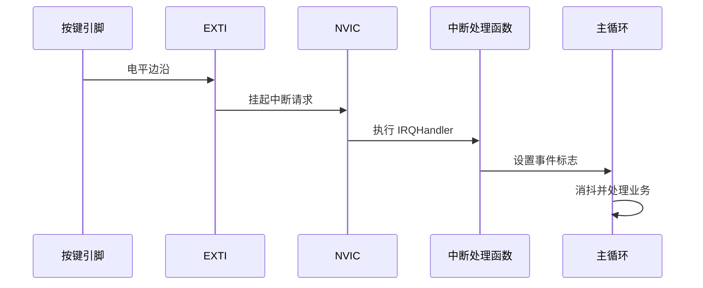

# 04 · EXTI 外部中断

<div class="lesson-progress" data-lesson-id="exti-001" data-lesson-title="EXTI 外部中断"></div>

## 学习目标

- 理解轮询与中断的区别；
- 配置 EXTI 触发边沿和 NVIC；
- 保持中断服务逻辑短小；
- 在主循环中完成按键消抖和事件处理。

## 事件链路



中断让 CPU 不必持续查询按键，但机械按键一次动作会产生多个快速边沿，因此“用了中断”不等于“自动消抖”。

## CubeMX 配置

1. 将按键引脚设为 `GPIO_EXTI`。
2. 按有效电平选择上升沿、下降沿或双边沿。普通按下事件优先只用一个边沿。
3. 配置合适的上拉/下拉。
4. 在 NVIC 设置中启用对应 EXTI 中断。
5. 生成代码，确认 `stm32xx_it.c` 调用了 `HAL_GPIO_EXTI_IRQHandler()`。

## 最小回调与主循环处理

在用户变量区添加：

```c
volatile uint8_t button_event = 0;
uint32_t last_button_time = 0;
```

在回调中只设置标志：

```c
void HAL_GPIO_EXTI_Callback(uint16_t GPIO_Pin)
{
  if (GPIO_Pin == BUTTON_Pin)
  {
    button_event = 1;
  }
}
```

在主循环处理消抖和业务：

```c
if (button_event)
{
  button_event = 0;
  uint32_t now = HAL_GetTick();

  if ((now - last_button_time) >= 50U)
  {
    last_button_time = now;
    if (HAL_GPIO_ReadPin(BUTTON_GPIO_Port, BUTTON_Pin) == GPIO_PIN_RESET)
    {
      HAL_GPIO_TogglePin(LED_GPIO_Port, LED_Pin);
    }
  }
}
```

无符号减法形式 `now - last_button_time` 能正确跨越系统节拍回绕。

!!! danger "中断中不要做这些事"
    不要在按键中断里长时间延时、等待串口发送、执行复杂格式化、访问慢速总线或写 Flash。这些操作会增加中断延迟，甚至造成死锁。

## 验收方法

- 快速按键 20 次，LED 每次只改变一次状态。
- 长按按键不会持续翻转（除非你明确实现了连发）。
- 在回调和主循环处理处分别设置断点，理解两段代码的执行顺序。
- 临时禁用 NVIC 后，按键不再触发，证明事件来自 EXTI 而非轮询逻辑。

## 常见问题

| 现象 | 可能原因 |
|---|---|
| 完全不进入回调 | NVIC 未启用、边沿选反、IRQHandler 未调用 HAL 处理函数 |
| 一次按键触发多次 | 机械抖动、双边沿配置、消抖状态设计不当 |
| 回调进入但引脚不匹配 | 检查传入的是 Pin 掩码而不是端口编号 |
| 系统偶尔卡住 | 中断中调用了阻塞函数或中断优先级不合理 |

## 练习

- 统计有效按键次数，并在调试器 Watch 窗口观察。
- 实现短按切换 LED、长按恢复默认状态；中断仍只负责产生事件。

## 官方资料与核对路径

| 文档 | 建议核对内容 |
|---|---|
| [RM0008 · STM32F1 Reference Manual](https://www.st.com/resource/en/reference_manual/cd00171190-stm32f101xx-stm32f102xx-stm32f103xx-stm32f105xx-and-stm32f107xx-advanced-armbased-32bit-mcus-stmicroelectronics.pdf) | `Interrupts and events`、EXTI 线路映射和触发寄存器 |
| [PM0056 · Cortex-M3 Programming Manual](https://www.st.com/resource/en/programming_manual/cd00228163-stm32f10xxx20xxx21xxxl1xxxx-cortexm3-programming-manual-stmicroelectronics.pdf) | `Exceptions and interrupts`、NVIC 和优先级分组 |
| [STM32CubeF1 官方仓库](https://github.com/STMicroelectronics/STM32CubeF1) | 在 `Projects/.../Examples/GPIO` 中核对官方中断示例 |

芯片限制仍需同时查看 [ES096](https://www.st.com/resource/en/errata_sheet/es096-stm32f101x8b-stm32f102x8b-and-stm32f103x8b-mediumdensity-device-limitations-stmicroelectronics.pdf)。

## 下一步

[用 UART 建立可见的调试通道 →](uart.md)
