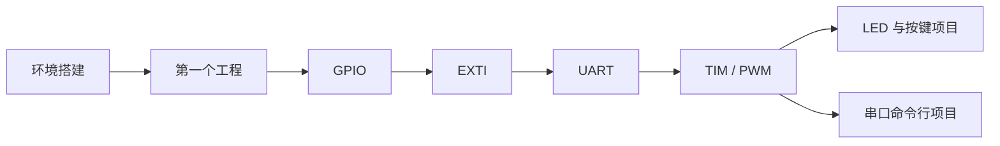

# 从点亮 LED，到构建可靠系统

一条本地优先、项目驱动的 STM32 学习路径。每节课都有明确产出、验证方法和常见故障处理，不要求你先成为硬件专家。

[从环境搭建开始](getting-started/environment.md){ .md-button .md-button--primary }
[查看完整路线](tracks/index.md){ .md-button }

## 你将怎样学习

### 1 · 先跑起来
安装工具，创建第一个工程，学会编译、下载、断点和串口日志。

### 2 · 理解外设
围绕 GPIO、EXTI、UART、定时器和 PWM 做可观察的实验。

### 3 · 做成项目
把零散知识放入状态机、驱动分层和故障处理等真实工程结构中。

### 4 · 走向系统
继续学习 DMA、RTOS、低功耗、Bootloader、安全更新和平台化设计。

## 第一阶段课程

| 课程 | 可见成果 | 建议时间 |
|---|---|---:|
| [环境搭建](getting-started/environment.md) | IDE、驱动和板卡连接正常 | 45–90 分钟 |
| [第一个工程](getting-started/first-project.md) | 可编译、下载、单步调试 | 60–90 分钟 |
| [GPIO](courses/gpio.md) | LED 闪烁、读取按键 | 60 分钟 |
| [EXTI](courses/exti.md) | 按键中断可靠触发 | 75 分钟 |
| [UART](courses/uart.md) | 串口收发与日志输出 | 90 分钟 |
| [TIM/PWM](courses/tim-pwm.md) | 无阻塞节拍与呼吸灯 | 90 分钟 |

## 本机学习进度

!!! info "进度保存在哪里？"
    进度只写入当前浏览器的 `localStorage`，不会上传。你可以随时导出 JSON 备份，或在另一浏览器导入。

