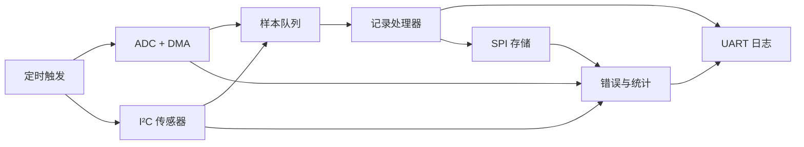
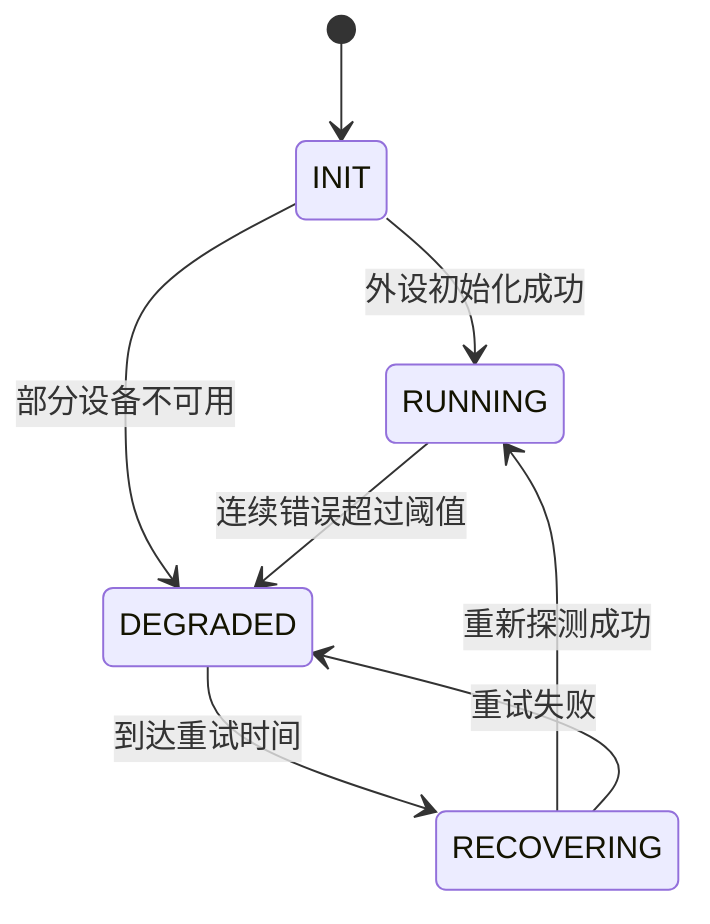

# 项目 3 · 多外设数据记录器

<div class="lesson-progress" data-lesson-id="project-data-logger" data-lesson-title="项目：多外设数据记录器"></div>

## 项目目标

构建一个能长期运行、可以观察错误并能恢复的最小数据记录器：

- 定时触发 ADC + DMA 采样；
- 通过 I²C 读取一个数字传感器；
- 可选：通过 SPI 写入外部存储器；
- 通过 UART 输出结构化日志；
- 不使用长时间阻塞延时；
- 传感器失联或缓冲区拥塞时给出明确状态。

## 先修课程

[UART](../courses/uart.md)、[TIM/PWM](../courses/tim-pwm.md)、[ADC/DMA](../courses/adc-dma.md)、[I²C](../courses/i2c.md)和[SPI](../courses/spi.md)。

## 系统结构



中断和 DMA 回调只提交事件，不进行格式化输出或复杂解析。主循环负责消费事件、组装记录并执行可控的恢复流程。

## 最小数据记录

```c
typedef struct {
    uint32_t timestamp_ms;
    uint16_t adc_average;
    int16_t sensor_value;
    uint16_t status_flags;
    uint32_t sequence;
} sample_record_t;
```

每条记录包含单调递增序号。这样可以从日志发现丢样、重复写入和重启。

## 状态设计



降级状态下仍应保留 UART 日志和可用的数据源，不能因为一个传感器离线让整个系统永久卡住。

## 实现顺序

### 1. 建立时间基准

使用系统节拍或硬件定时器产生固定周期事件。先打印序号和时间戳，验证主循环没有阻塞。

### 2. 接入 ADC + DMA

只在完整缓冲区可用时计算统计值。记录 DMA 完成次数和处理次数，两者长期不一致意味着数据被覆盖或消费速度不足。

### 3. 接入 I²C 传感器

先读取身份寄存器，再读取业务数据。对每次事务设置超时，并统计连续失败次数。

### 4. 输出结构化日志

```text
seq=1024 time_ms=51200 adc=2048 sensor=237 status=0x0000
```

固定字段名比自然语言更方便后续脚本处理。错误日志至少包含外设、操作、返回状态和累计次数。

### 5. 可选 SPI 存储

先实现单块写入与读回校验，再增加循环日志。断电一致性、擦除寿命和文件系统不在最小版本中，但必须记录为后续风险。

## 缓冲区规则

- DMA 正在写的区域不能被业务层修改；
- UART 或 SPI 尚未发送完成的数据不能提前复用；
- 队列满时必须选择“丢最新”“丢最旧”或“停止采样”，并记录次数；
- 不在回调中使用大型局部数组或大量 `printf`。

## 故障注入

至少主动制造并验证：

| 场景 | 预期行为 |
|---|---|
| 拔掉 I²C 传感器 | 超时返回、记录错误、其他功能继续 |
| UART 接收端停止读取 | 不让日志阻塞采样主路径 |
| ADC 输入悬空 | 统计值波动明显，系统不崩溃 |
| SPI 器件无响应 | 放弃本次写入并进入受控重试 |
| 队列被填满 | 按既定策略处理并增加溢出计数 |

## 完成定义

- 连续运行至少 30 分钟，无 HardFault 和无不可恢复阻塞；
- 日志可以证明采样周期和记录序号连续；
- 每个外设都有超时、错误计数和恢复入口；
- README 记录板卡、引脚、工具版本、采样周期和测试结果；
- 能解释每个缓冲区的写入者、读取者和生命周期。

## 扩展挑战

- 将日志保存为可由 Python 脚本绘图的 CSV；
- 增加看门狗，但只在确认关键路径健康时刷新；
- 为两个 STM32 系列分别实现 BSP，保持业务层接口不变；
- 记录复位原因，并在启动日志中报告上一次异常。
