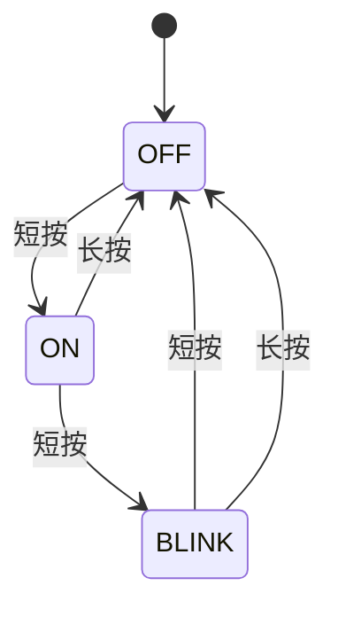

# 项目 1 · LED 与按键控制器

## 项目目标

用一个按键控制 LED 的三种模式，并保持主循环非阻塞：

1. 常灭；
2. 常亮；
3. 以 2 Hz 闪烁。

短按切换模式，长按 1.5 秒恢复常灭。按键由 EXTI 产生事件，主循环负责消抖、长按识别和 LED 状态更新。

## 先修课程

[GPIO](../courses/gpio.md)、[EXTI](../courses/exti.md)和[TIM/PWM](../courses/tim-pwm.md)。

## 状态设计



把硬件极性封装起来，业务层只表达“亮/灭”：

```c
typedef enum {
  LED_MODE_OFF = 0,
  LED_MODE_ON,
  LED_MODE_BLINK
} LedMode;

static void Led_Set(bool on)
{
  HAL_GPIO_WritePin(LED_GPIO_Port, LED_Pin,
                    on ? GPIO_PIN_SET : GPIO_PIN_RESET);
}
```

如果你的 LED 低电平有效，只需在 `Led_Set()` 中反转写入值，状态机无需改动。

## 推荐模块

| 模块 | 输入 | 输出/职责 |
|---|---|---|
| EXTI 回调 | 按键边沿 | 设置 `edge_pending` 和时间戳 |
| Button_Update | 当前电平、系统节拍 | 产生 `SHORT_PRESS` / `LONG_PRESS` |
| Controller_Update | 按键事件 | 切换 `LedMode` |
| Led_Update | 模式、系统节拍 | 输出 LED 电平 |

## 实现步骤

### 1. 先验证硬件

分别使用最小程序确认 LED 可控、按键电平正确、EXTI 能进入回调。不要在三个基础条件都未知时直接调状态机。

### 2. 实现消抖后的按下/释放

记录原始电平发生变化的时刻，电平连续稳定 30–50 ms 后再更新“稳定状态”。按下时记录 `press_started_at`，释放时计算持续时间。

```c
typedef enum { BUTTON_NONE, BUTTON_SHORT, BUTTON_LONG } ButtonEvent;

static ButtonEvent Button_Classify(uint32_t held_ms)
{
  if (held_ms >= 1500U) return BUTTON_LONG;
  if (held_ms >= 50U) return BUTTON_SHORT;
  return BUTTON_NONE;
}
```

### 3. 实现模式切换

```c
static void Controller_Handle(ButtonEvent event, LedMode *mode)
{
  if (event == BUTTON_LONG)
  {
    *mode = LED_MODE_OFF;
  }
  else if (event == BUTTON_SHORT)
  {
    *mode = (LedMode)((*mode + 1) % 3);
  }
}
```

### 4. 实现非阻塞闪烁

```c
static void Led_Update(LedMode mode, uint32_t now)
{
  static uint32_t last_toggle = 0;
  static bool level = false;

  if (mode == LED_MODE_OFF) { level = false; Led_Set(false); return; }
  if (mode == LED_MODE_ON)  { level = true;  Led_Set(true);  return; }

  if ((now - last_toggle) >= 250U)
  {
    last_toggle = now;
    level = !level;
    Led_Set(level);
  }
}
```

每 250 ms 翻转一次，对应完整亮灭周期 500 ms，即 2 Hz。

## 测试清单

- [ ] 连续短按 30 次，每次只切换一个模式。
- [ ] 在三种模式下长按都恢复常灭。
- [ ] 长按期间系统没有卡死，仍可更新其他任务。
- [ ] 系统节拍接近回绕时，所有时间比较仍使用无符号差值。
- [ ] 断开按键或制造抖动时，不会持续快速切换。

## 扩展挑战

- 通过 UART 打印模式变化，但不要在中断中发送。
- 将当前模式写入 Flash，并考虑写入寿命、校验和断电一致性。
- 增加双击事件，明确它对单击响应延迟的影响。

