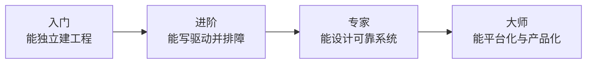

# 学习路线总览

路线按能力而不是“看过多少章节”划分。只有完成阶段项目并能独立排障，才算真正进入下一阶段。

| 阶段 | 重点 | 建议成果 |
|---|---|---|
| [入门](beginner.md) | 工具、GPIO、UART、TIM、基础调试 | 01～06 课程和完整实验记录 |
| [进阶](advanced.md) | DMA、通信总线、存储、驱动分层 | 多外设数据采集系统 |
| [专家](expert.md) | RTOS、低功耗、Bootloader、性能 | 可升级、可诊断的中型系统 |
| [大师](master.md) | 安全、平台化、自动测试、量产 | 可复用平台与交付流程 |

!!! note "允许交叉学习"
    路线不是硬性门禁。你可以提前浏览 RTOS 或安全主题，但遇到问题时应能退回必要的先修知识，而不是用复制代码掩盖理解缺口。

!!! info "全站统一顺序"
    主线固定为 01～09 课程，随后依次完成 LED 与按键控制器、串口命令行终端、多外设数据记录器。首页、进度面板和课程前后导航都使用这个顺序。
